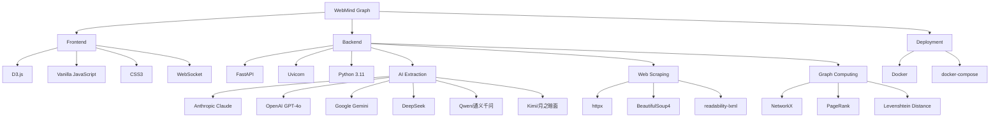

# WebMind Graph

Paste URLs, get a knowledge graph. See what multiple articles agree on, disagree on, and uniquely contribute.

## Features

WebMind Graph is an AI-powered knowledge extraction and visualization tool that analyzes multiple web articles to create interactive comparison graphs. It identifies consensus, controversies, and unique contributions across different sources.

### Key Features:

- **Multi-Article Comparison**: Analyze 2+ web pages at once
- **Consensus Detection**: Identify shared concepts across all articles
- **Controversy Identification**: Highlight conflicting viewpoints and opposing arguments
- **Unique Contributions**: Show concepts unique to individual sources
- **Similarity Matrix**: Visualize how articles relate to each other
- **Interactive Knowledge Graph**: D3.js force-directed graph with real-time updates
- **Multiple AI Models**: Support for Anthropic Claude, OpenAI GPT-4o, Google Gemini, and more
- **Manual Content Input**: Fallback for JavaScript-rendered pages

## Tech Stack



## Project Structure

```
webmind-graph/
├── backend/
│   ├── main.py              # FastAPI entry point + WebSocket endpoints
│   ├── scraper.py           # Web scraping and content extraction
│   ├── ai_extractor.py      # Multi-provider AI extraction
│   ├── graph_builder.py     # NetworkX graph algorithms
│   ├── models.py            # Pydantic data models
│   ├── prompts.py           # AI system prompts
│   └── providers/           # AI model implementations
├── frontend/
│   ├── index.html           # Single page app entry
│   ├── graph.js             # D3.js force-directed graph
│   ├── panel.js             # Right-side analysis panel
│   ├── websocket.js         # Real-time communication
│   └── style.css            # Dark theme UI
├── Dockerfile
├── docker-compose.yml
├── requirements.txt
└── README.md
```

## Installation & Run

### Quick Start (Docker)

1. **Clone and navigate**:
   ```bash
   cd webmind-graph
   ```

2. **Set environment variable**:
   ```bash
   export ANTHROPIC_API_KEY="your-api-key"
   ```

3. **Docker Deployment**:
   ```bash
   docker-compose up --build
   ```

4. **Access application**:
   Open your browser and navigate to `http://localhost:8000`

### Local Development

1. **Create and activate virtual environment**:
   ```bash
   python -m venv venv
   source venv/bin/activate  # macOS/Linux
   venv\Scripts\activate  # Windows
   ```

2. **Install dependencies**:
   ```bash
   pip install -r requirements.txt
   ```

3. **Configure environment variables**:
   ```bash
   cp .env.example .env
   # Edit .env file to add your API keys
   ```

4. **Run the application**:
   ```bash
   uvicorn backend.main:app --host 0.0.0.0 --port 8000 --reload
   ```

## Usage

1. **Enter URLs**: Paste 2+ URLs in the input field (one per line)
2. **Crawl**: Click "Crawl" to start analyzing the web pages
3. **Wait**: The AI will process each article and extract knowledge graph data
4. **Analyze**: View the interactive graph with consensus, controversies, and unique concepts
5. **Interact**:
   - Click nodes to see details
   - Use "争议模式" (Controversy Mode) to highlight conflicts
   - Use "核心概念" (Core Concepts Mode) to focus on shared ideas
   - Adjust graph parameters in the control panel

## Error Handling

- **URL Access Issues**: Automatically skips and continues with other URLs
- **Content Extraction Failures**: Shows manual input form for JavaScript-rendered pages
- **API Rate Limits**: Implements retry mechanisms
- **Node Overload**: Automatically filters nodes if graph exceeds 200 elements

## Contributing

### Reporting Issues

1. Check if the issue already exists in the tracker
2. Include steps to reproduce
3. Add screenshots if relevant
4. Mention your OS and browser

### Feature Requests

1. Describe the feature and its use case
2. Explain how it fits into the project goals
3. Include any relevant examples or references

### Development Guidelines

1. **Branch Strategy**: Use feature branches for new development
2. **Code Style**: Follow PEP 8 for Python, standard JS for frontend
3. **Testing**: Write tests for new features
4. **Documentation**: Update README.md and docstrings as needed
5. **Commit Messages**: Use clear, concise messages explaining the change

## License

MIT License - feel free to use and modify as needed.
